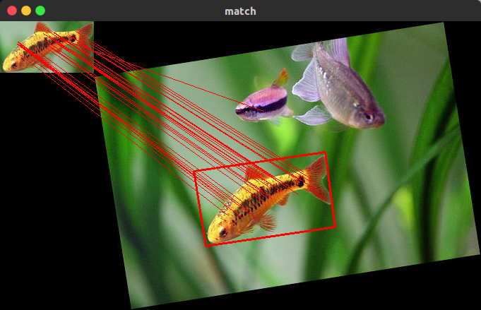

利用SURF特征点匹配，在给定图像中找出和模板图像匹配的区域。

## 实现代码
```python
# _*_ coding:utf-8 _*_

import cv2
import numpy as np


def drawMatches(img1_gray, post1, img2_gray, post2, goodMatch):
    h1, w1 = img1_gray.shape[:2]
    h2, w2 = img2_gray.shape[:2]

    vis = np.zeros((max(h1, h2), w1 + w2, 3), np.uint8)
    vis[:h1, :w1] = img1_gray
    vis[:h2, w1:w1 + w2] = img2_gray
    # vis = np.hstack((img1_gray, img2_gray)) # 不可以, hstack两个图像必须一样高

    post2 += (w1, 0)  # 右图中的点, 在合并后的新图中坐标右移, 所以+(左图的宽度, 0)
    for (x1, y1), (x2, y2) in zip(post1, post2):
        cv2.line(vis, (x1, y1), (x2, y2), (0, 0, 255))

    return vis


if __name__ == "__main__":

    target = cv2.imread('target_fish.jpg')
    source = cv2.imread('fish.jpg')
    target = cv2.resize(target, None, None, fx=0.7, fy=0.7)

    # get gray
    target_gray = cv2.cvtColor(target, cv2.COLOR_BGR2GRAY)
    source_gray = cv2.cvtColor(source, cv2.COLOR_BGR2GRAY)

    # detect surf keypoints and compute descriptors
    detector = cv2.xfeatures2d.SURF_create()
    kp1, des1 = detector.detectAndCompute(target_gray, None)
    kp2, des2 = detector.detectAndCompute(source_gray, None)

    # match keypoints according to descriptors
    matcher = cv2.FlannBasedMatcher()
    matches = matcher.match(des1, des2)

    # find max and min dist
    min_dist = 100
    max_dist = 0
    for m in matches:
        if m.distance < min_dist:
            min_dist = m.distance
        if m.distance > max_dist:
            max_dist = m.distance
    print('min dist:', min_dist, ' max dist:', max_dist)

    # find good matches
    good_matches = []
    for m in matches:
        # Test 1
        if m.distance < min_dist + 0.3 * (max_dist - min_dist):
        # Test 2
        # if m.distance < min_dist+0.08*(max_dist-min_dist):
            good_matches.append(m)
    print('num of good matches:', len(good_matches))

    # get good matches points
    p1 = [kpp.queryIdx for kpp in good_matches]
    p2 = [kpp.trainIdx for kpp in good_matches]

    post1 = np.float32([kp1[pp].pt for pp in p1])
    post2 = np.float32([kp2[pp].pt for pp in p2])

    # get homography matrix
    post1 = post1.reshape(-1, 1, 2)  # .reshape(-1,1,2)很重要
    post2 = post2.reshape(-1, 1, 2)  #
    H, mask = cv2.findHomography(post1, post2, cv2.RANSAC)  # 求单应变换矩阵
    print H

    # get perspective points of target corners
    h, w = target_gray.shape
    target_corners = np.float32([[0, 0], [0, h-1], [w-1, h-1], [w-1, 0]]).reshape(-1, 1, 2)  # .reshape(-1,1,2)很重要
    source_corners = cv2.perspectiveTransform(target_corners, H).squeeze()  # 有一维没有用, 所以squeeze
    print source_corners

    # draw the found (or matched) region
    cv2.line(source, tuple(source_corners[0]), tuple(source_corners[1]), color=(0, 0, 255), thickness=2)
    cv2.line(source, tuple(source_corners[0]), tuple(source_corners[3]), color=(0, 0, 255), thickness=2)
    cv2.line(source, tuple(source_corners[1]), tuple(source_corners[2]), color=(0, 0, 255), thickness=2)
    cv2.line(source, tuple(source_corners[2]), tuple(source_corners[3]), color=(0, 0, 255), thickness=2)

    cv2.namedWindow("find", cv2.WINDOW_NORMAL)
    cv2.imshow("find", source)

    # draw good matched keypoints, show as stacked pics
    vis = drawMatches(target, post1.reshape((-1, 2)), source, post2.reshape((-1, 2)), good_matches)  # post1 and post2 should reshape back
    cv2.namedWindow("match", cv2.WINDOW_NORMAL)
    cv2.imshow("match", vis)

    cv2.waitKey()
    cv2.destroyAllWindows()
    
```
## 匹配效果


## 参考资料
https://www.programcreek.com/python/example/89377/cv2.perspectiveTransform